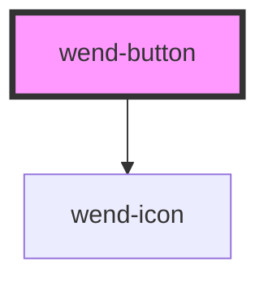

# wend-button

<!-- Auto Generated Below -->

## Properties

| Property    | Attribute    | Description                                                                                                                                  | Type                                                                                                                   | Default     |
| ----------- | ------------ | -------------------------------------------------------------------------------------------------------------------------------------------- | ---------------------------------------------------------------------------------------------------------------------- | ----------- |
| `disabled`  | `disabled`   | Disables the button.                                                                                                                         | `boolean`                                                                                                              | `false`     |
| `iconLeft`  | `icon-left`  | Name of a wend-ui icon to render on the left of the button label.                                                                            | `string \| undefined`                                                                                                  | `undefined` |
| `iconRight` | `icon-right` | Name of a wend-ui icon to render on the right of the button label.                                                                           | `string \| undefined`                                                                                                  | `undefined` |
| `label`     | `label`      | The content of the button. This is required, but can be an empty string for an icon-only button as it will be skipped for icon-only buttons. | `string`                                                                                                               | `''`        |
| `variant`   | `variant`    | Visual style of the button.                                                                                                                  | `"destructive-primary" \| "destructive-secondary" \| "destructive-tertiary" \| "primary" \| "secondary" \| "tertiary"` | `'primary'` |

## Dependencies

### Depends on

- [wend-icon](../wend-icon)

### Graph

----------------------------------------------

*Built with [StencilJS](https://stenciljs.com/)*
