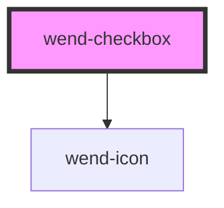

# wend-checkbox

<!-- Auto Generated Below -->

## Properties

| Property   | Attribute  | Description                                                                  | Type      | Default |
| ---------- | ---------- | ---------------------------------------------------------------------------- | --------- | ------- |
| `checked`  | `checked`  | Whether the checkbox is checked.                                             | `boolean` | `false` |
| `disabled` | `disabled` | Disables the checkbox.                                                       | `boolean` | `false` |
| `label`    | `label`    | The checkbox's label text. Can be an empty string for a label-less checkbox. | `string`  | `''`    |

## Events

| Event        | Description                                       | Type                   |
| ------------ | ------------------------------------------------- | ---------------------- |
| `wendChange` | Emitted when the checkbox is toggled by the user. | `CustomEvent<boolean>` |

## Dependencies

### Depends on

- [wend-icon](../wend-icon)

### Graph

----------------------------------------------

*Built with [StencilJS](https://stenciljs.com/)*
