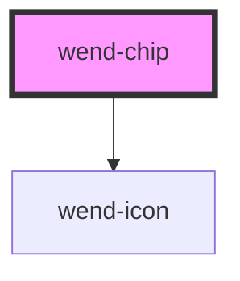

# wend-chip

<!-- Auto Generated Below -->

## Properties

| Property   | Attribute  | Description                                              | Type      | Default |
| ---------- | ---------- | -------------------------------------------------------- | --------- | ------- |
| `closable` | `closable` | Whether the chip renders a close button for removing it. | `boolean` | `true`  |
| `disabled` | `disabled` | Disables the chip and its close button.                  | `boolean` | `false` |
| `label`    | `label`    | The chip's label text.                                   | `string`  | `''`    |

## Events

| Event       | Description                                                             | Type                |
| ----------- | ----------------------------------------------------------------------- | ------------------- |
| `wendClose` | Emitted when the close button is activated. Not emitted while disabled. | `CustomEvent<void>` |

## Dependencies

### Depends on

- [wend-icon](../wend-icon)

### Graph

----------------------------------------------

*Built with [StencilJS](https://stenciljs.com/)*
