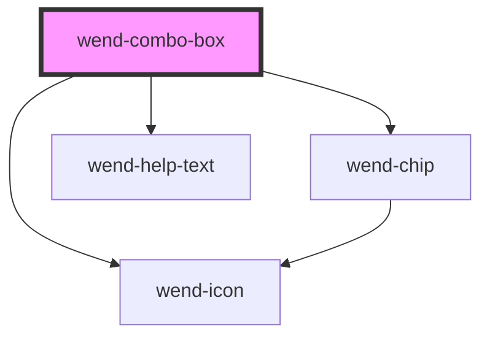

# wend-combo-box

<!-- Auto Generated Below -->

## Properties

| Property       | Attribute        | Description                                                                                                                                                                                                            | Type                                             | Default     |
| -------------- | ---------------- | ---------------------------------------------------------------------------------------------------------------------------------------------------------------------------------------------------------------------- | ------------------------------------------------ | ----------- |
| `disabled`     | `disabled`       | Disables the combo box and every wend-option child.                                                                                                                                                                    | `boolean`                                        | `false`     |
| `helpText`     | `help-text`      | Supplementary message shown below the field, e.g. a validation message. Can be an empty string to render nothing.                                                                                                      | `string`                                         | `''`        |
| `label`        | `label`          | The combo box's label text. Can be an empty string for a label-less field.                                                                                                                                             | `string`                                         | `''`        |
| `name`         | `name`           | Name submitted for this combo box when part of a form.                                                                                                                                                                 | `string \| undefined`                            | `undefined` |
| `placeholder`  | `placeholder`    | Text shown in the field when no option is selected.                                                                                                                                                                    | `string`                                         | `'Select…'` |
| `required`     | `required`       | Marks the field as required. Renders a marker after the label and sets aria-required on the field.                                                                                                                     | `boolean`                                        | `false`     |
| `showHelpText` | `show-help-text` | Whether the help text is rendered.                                                                                                                                                                                     | `boolean`                                        | `true`      |
| `showLabel`    | `show-label`     | Whether the label is rendered.                                                                                                                                                                                         | `boolean`                                        | `true`      |
| `state`        | `state`          | Validation state of the field. Drives the field's border color and the help text's tone.                                                                                                                               | `"default" \| "error" \| "success" \| "warning"` | `'default'` |
| `values`       | --               | Values of the currently selected wend-option children. A complex (array) prop — set this via the JS property (`el.values = [...]`), not an HTML attribute; Stencil doesn't parse array-typed attributes automatically. | `string[]`                                       | `[]`        |

## Events

| Event        | Description                                                                              | Type                    |
| ------------ | ---------------------------------------------------------------------------------------- | ----------------------- |
| `wendChange` | Emitted whenever the selection changes: an option toggled, a chip removed, or clear-all. | `CustomEvent<string[]>` |

## Dependencies

### Depends on

- [wend-chip](../wend-chip)
- [wend-icon](../wend-icon)
- [wend-help-text](../wend-help-text)

### Graph

----------------------------------------------

*Built with [StencilJS](https://stenciljs.com/)*
