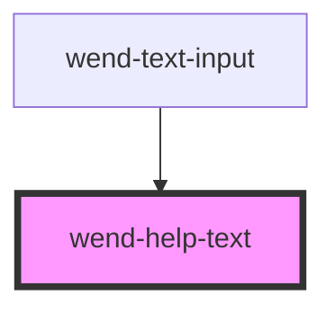

# wend-help-text

<!-- Auto Generated Below -->

## Properties

| Property | Attribute | Description                                                        | Type                                             | Default     |
| -------- | --------- | ------------------------------------------------------------------ | ------------------------------------------------ | ----------- |
| `text`   | `text`    | The help text's message. Can be an empty string to render nothing. | `string`                                         | `''`        |
| `type`   | `type`    | Visual tone of the help text.                                      | `"default" \| "error" \| "success" \| "warning"` | `'default'` |

## Dependencies

### Used by

 - [wend-text-input](../wend-text-input)

### Graph

----------------------------------------------

*Built with [StencilJS](https://stenciljs.com/)*
