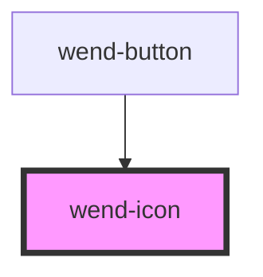

# wend-icon

<!-- Auto Generated Below -->

## Properties

| Property            | Attribute | Description                                                                | Type     | Default          |
| ------------------- | --------- | -------------------------------------------------------------------------- | -------- | ---------------- |
| `color`             | `color`   | Icon fill color, as a CSS color.                                           | `string` | `'currentColor'` |
| `name` _(required)_ | `name`    | Name of the icon to render, matching a name in the wend-ui icons manifest. | `string` | `undefined`      |
| `size`              | `size`    | Icon size, as a CSS length.                                                | `string` | `'1em'`          |

## Dependencies

### Used by

 - [wend-button](../wend-button)

### Graph

----------------------------------------------

*Built with [StencilJS](https://stenciljs.com/)*
