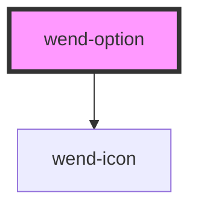

# wend-option

<!-- Auto Generated Below -->

## Properties

| Property             | Attribute   | Description                                                                                                                                                                                                | Type                  | Default     |
| -------------------- | ----------- | ---------------------------------------------------------------------------------------------------------------------------------------------------------------------------------------------------------- | --------------------- | ----------- |
| `active`             | `active`    | Whether this option is the keyboard-active one (highlighted, not necessarily selected). Set by the parent wend-select.                                                                                     | `boolean`             | `false`     |
| `disabled`           | `disabled`  | Disables this option, excluding it from selection and keyboard navigation.                                                                                                                                 | `boolean`             | `false`     |
| `optionId`           | `option-id` | DOM id applied to the option's role="option" element. Set by the parent wend-select (not by the consumer) so its trigger button's aria-activedescendant can reference the keyboard-active option directly. | `string \| undefined` | `undefined` |
| `selected`           | `selected`  | Whether this option is the currently selected one. Set by the parent wend-select, not by the consumer directly.                                                                                            | `boolean`             | `false`     |
| `value` _(required)_ | `value`     | Value submitted for this option when selected by its parent wend-select.                                                                                                                                   | `string`              | `undefined` |

## Events

| Event        | Description                                                                                                                                                                                               | Type                   |
| ------------ | --------------------------------------------------------------------------------------------------------------------------------------------------------------------------------------------------------- | ---------------------- |
| `wendChange` | Emitted when the option is clicked. Mirrors wend-radio's wendChange shape (a boolean, always true here since clicking an option only ever means "select me") so the parent wend-select can reuse the same | `CustomEvent<boolean>` |

## Dependencies

### Depends on

- [wend-icon](../wend-icon)

### Graph

----------------------------------------------

*Built with [StencilJS](https://stenciljs.com/)*
