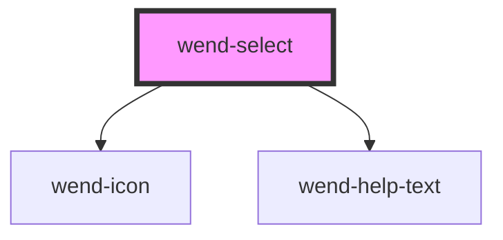

# wend-select

<!-- Auto Generated Below -->

## Properties

| Property       | Attribute        | Description                                                                                                       | Type                                             | Default     |
| -------------- | ---------------- | ----------------------------------------------------------------------------------------------------------------- | ------------------------------------------------ | ----------- |
| `disabled`     | `disabled`       | Disables the select and every wend-option child.                                                                  | `boolean`                                        | `false`     |
| `helpText`     | `help-text`      | Supplementary message shown below the field, e.g. a validation message. Can be an empty string to render nothing. | `string`                                         | `''`        |
| `label`        | `label`          | The select's label text. Can be an empty string for a label-less select.                                          | `string`                                         | `''`        |
| `name`         | `name`           | Name submitted for this select when part of a form.                                                               | `string \| undefined`                            | `undefined` |
| `placeholder`  | `placeholder`    | Text shown in the trigger when no option is selected.                                                             | `string`                                         | `'Select…'` |
| `required`     | `required`       | Marks the select as required. Renders a marker after the label and sets aria-required on the trigger.             | `boolean`                                        | `false`     |
| `showHelpText` | `show-help-text` | Whether the help text is rendered.                                                                                | `boolean`                                        | `true`      |
| `showLabel`    | `show-label`     | Whether the label is rendered.                                                                                    | `boolean`                                        | `true`      |
| `state`        | `state`          | Validation state of the field. Drives the field's border color and the help text's tone.                          | `"default" \| "error" \| "success" \| "warning"` | `'default'` |
| `value`        | `value`          | Value of the currently selected wend-option child.                                                                | `string \| undefined`                            | `undefined` |

## Events

| Event        | Description                              | Type                  |
| ------------ | ---------------------------------------- | --------------------- |
| `wendChange` | Emitted when the selected value changes. | `CustomEvent<string>` |

## Dependencies

### Depends on

- [wend-icon](../wend-icon)
- [wend-help-text](../wend-help-text)

### Graph

----------------------------------------------

*Built with [StencilJS](https://stenciljs.com/)*
