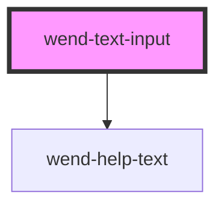

# wend-text-input

<!-- Auto Generated Below -->

## Properties

| Property       | Attribute        | Description                                                                                                                                                                                                                                                          | Type                                             | Default     |
| -------------- | ---------------- | -------------------------------------------------------------------------------------------------------------------------------------------------------------------------------------------------------------------------------------------------------------------- | ------------------------------------------------ | ----------- |
| `disabled`     | `disabled`       | Disables the input.                                                                                                                                                                                                                                                  | `boolean`                                        | `false`     |
| `helpText`     | `help-text`      | Supplementary message shown below the input, e.g. a validation message. Can be an empty string to render nothing.                                                                                                                                                    | `string`                                         | `''`        |
| `label`        | `label`          | The input's label text. Can be an empty string for a label-less input.                                                                                                                                                                                               | `string`                                         | `''`        |
| `name`         | `name`           | Name submitted for this input when part of a form.                                                                                                                                                                                                                   | `string \| undefined`                            | `undefined` |
| `placeholder`  | `placeholder`    | Placeholder text shown when the input is empty.                                                                                                                                                                                                                      | `string \| undefined`                            | `undefined` |
| `required`     | `required`       | Marks the input as required. Renders a marker after the label and sets the native `required`/`aria-required` attributes on the input.                                                                                                                                | `boolean`                                        | `false`     |
| `showHelpText` | `show-help-text` | Whether the help text is rendered.                                                                                                                                                                                                                                   | `boolean`                                        | `true`      |
| `showLabel`    | `show-label`     | Whether the label is rendered.                                                                                                                                                                                                                                       | `boolean`                                        | `true`      |
| `state`        | `state`          | Validation state of the input. Drives the field's border color and the help text's tone. The interactive focus ring is handled separately via CSS `:focus-within`, not this prop, so a focused input keeps combining with whichever validation state is already set. | `"default" \| "error" \| "success" \| "warning"` | `'default'` |
| `value`        | `value`          | The input's current text value.                                                                                                                                                                                                                                      | `string`                                         | `''`        |

## Events

| Event        | Description                | Type                  |
| ------------ | -------------------------- | --------------------- |
| `wendChange` | Emitted as the user types. | `CustomEvent<string>` |

## Dependencies

### Depends on

- [wend-help-text](../wend-help-text)

### Graph

----------------------------------------------

*Built with [StencilJS](https://stenciljs.com/)*
